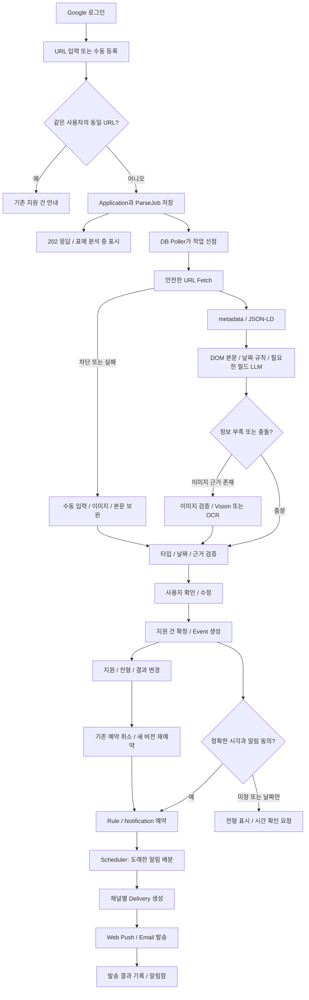
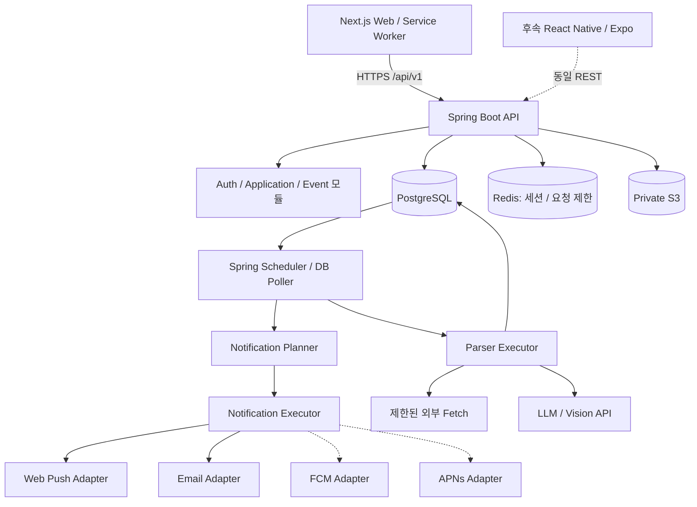
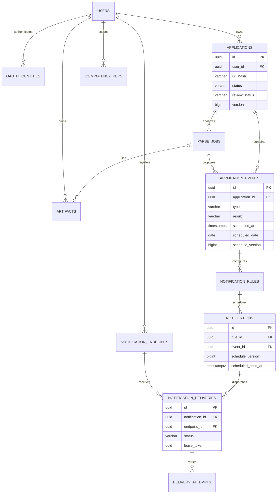
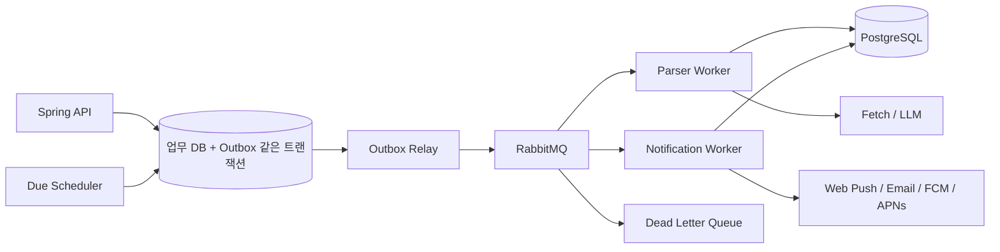

# 한국 취준생을 위한 채용공고·지원 일정 관리 서비스 기술 설계서

작성일: 2026-09-10 · 설계 버전: 1.0 · 대상: 웹 MVP를 구현하는 프런트엔드·백엔드 개발자

이 문서는 **공고 URL 저장 → 정보 추출 → 사용자 확인 → 전형별 일정 관리 → 알림**을 구현하기 위한 설계다. 기존 대화와 첨부된 Notion 표를 참고하되 초기 화면은 `상태 / 회사·직무 / 서류 / NCS / 코테 / 1차 / 2차 / 관리`로 구성한다. URL은 행에 표시하지 않고 회사·직무의 원본 링크로 사용한다. 사용자 개인 지원 기록이 데이터의 중심이며, 공고 수집 플랫폼 전체를 만드는 범위는 아니다.

이 문서의 시간·용량·횟수·성능 수치는 별도 표시가 없으면 **MVP의 제안 기본값**이다. 실측 성능이나 외부 서비스의 보장치가 아니다. 기술 문서는 공식 자료로 확인했으며, 구체적인 모델 가격·사이트별 수집 성공률은 가정하지 않는다.

## 1. 서비스 개요와 MVP 범위

### 1.1 해결할 문제

취준생은 여러 사이트에서 찾은 공고의 회사·직무·마감일과 지원 이후 코딩테스트·NCS·AI역량검사·면접 일정을 직접 표에 입력한다. 이 서비스는 입력을 줄이고, **확인된 일정에 대해 필요한 시점에 알림을 보내는 것**을 핵심 가치로 한다.

- URL을 넣으면 즉시 지원 기록 한 행이 생긴다. 분석은 백그라운드에서 진행한다.
- URL은 직접 등록 또는 상세에서 등록·수정할 수 있고, 지원현황의 회사·직무를 클릭하면 원본 공고를 새 탭으로 연다.
- 회사·직무·전형·날짜의 추출 근거를 보여주고 사용자가 수정·확정한다.
- 일정 없는 전형도 `날짜 미정`으로 남겨, 이후 안내받은 일정을 쉽게 입력한다.
- 각 전형의 진행 상태와 합격·불합격 결과를 독립적으로 관리한다.
- 사용자가 확정한 정확한 시각만 외부 알림을 예약한다.

### 1.2 출시 범위

| 구분 | 포함 | 제외·후속 |
|---|---|---|
| 로그인 | Google OAuth 1개, 계정·로그아웃 | Kakao 추가, 계정 병합 |
| 공고 저장 | URL, 수동 등록, 이미지 업로드·본문 붙여넣기 보완 | 대규모 공고 크롤링, 플랫폼 전체 검색 |
| 자동 추출 | JSON-LD·metadata, DOM, 필요시 LLM, 이미지 Vision/OCR | 모든 채용사이트 보장, 로그인·CAPTCHA 우회, PDF |
| 지원 기록 | 표·검색·필터·상세 패널·메모·보관 | Notion/CSV 가져오기, 칸반, 협업 |
| 전형 | 서류·코테·NCS·AI검사·면접·결과발표·사용자 정의 | 이메일 본문 자동 감지 |
| 알림 | Web Push·이메일, 1일 전·3시간 전·직접 설정, 알림함 | 문자·카카오 알림톡·조용한 시간·반복 일정 |
| 앱 | 공통 REST API·채널 인터페이스 설계 | 실제 Expo 앱·공유 확장 구현 |
| 인프라 | Spring 모놀리스, DB 작업 큐 | RabbitMQ·별도 Worker 운영 |

사이트 이름은 지원 보장이 아니다. 초기에는 허용되는 공개 페이지 중 대표 표본으로 검증한 1~2개 패턴부터 지원하고, 그 외는 범용 추출과 수동 보완을 제공한다.

### 1.3 Notion식 화면

```text
[공고 URL 붙여넣기________________] [저장] [직접 추가]
[전체] [지원 예정] [진행 중] [이번 주 일정] [확인 필요]

상태     | 회사 / 직무       | 서류             | NCS      | 코테      | 1차면접 | 2차면접 | 관리
대기     | 예시기업 / 백엔드↗| 9/18 17:00 D-8   | -        | 날짜 미정 | -       | -       | 수정
합격     | 예시공사 / 전산↗  | 접수 완료         | NCS 9/20 | -         | 날짜 미정| -       | 수정
확인필요 | 분석 중…          | 확인 전           | -        | -         | -       | -       | 수정
```

표의 코테·면접 셀은 `applications`의 고정 컬럼이 아니라 `application_events`를 화면에서 묶어 표시한 값이다. 같은 유형이 두 번 있으면 가장 가까운 미완료 일정과 `+1`을 표시하고 상세 패널에서 전부 보여준다. NCS·AI검사도 열을 켜거나 상세에서 관리한다. 날짜 미정은 `미정`, 날짜만 있으면 `시간 확인 필요`, 없는 전형은 `-`로 구분한다.

분석 결과 패널에는 `추출값 / 원문 근거 / 수정 입력 / 일정별 알림 설정`을 둔다. 저장 성공과 분석 성공은 별개다. 분석에 실패해도 행을 유지하고 `직접 입력`으로 전환한다. 초기 표에는 가로 스크롤·고정 회사 열·상태 배지·행 상세 패널만 구현한다.

지원현황 표에는 URL 열을 두지 않는다. URL이 있으면 회사·직무를 원본 공고로 연결하고 새 탭으로 연다. 내부 관리 화면은 관리 열의 `수정` 링크를 유지한다. URL이 없으면 회사·직무가 수정 화면으로 이동하며 수동 등록에서도 URL은 선택 사항이다.

## 2. 핵심 설계 결정

1. **Application은 한 사용자의 지원 건**, Event는 그 지원 건에 속한 전형, Notification은 특정 전형의 특정 버전에 대한 알림이다.
2. 분석값은 `parse_jobs.result_json`에 후보로 저장한다. 사용자 확인 전에는 확정 일정과 섞지 않는다.
3. 영속 작업 상태는 PostgreSQL에 둔다. Redis는 세션·요청 제한에 쓰며 작업 유실 방지의 근거로 삼지 않는다.
4. `@Async` 호출만으로 작업을 넘기지 않는다. DB 폴러가 저장된 작업을 회수하므로 재시작 후에도 이어진다.
5. 외부 발송의 정확히 한 번 전달은 보장하지 않는다. DB 중복 생성은 제약으로 막고, 외부 전송의 불확실성은 별도 상태로 관리한다.
6. 일정 변경과 기존 알림 취소·새 예약을 하나의 DB 트랜잭션으로 처리한다.
7. MVP는 사용자별 URL 중복만 제거한다. 다른 사용자의 비공개 URL·결과를 전역 공유 캐시로 섞지 않는다.

## 3. 전체 서비스 흐름도



수동 등록은 분석 단계를 생략한다. 사용자가 입력한 Event도 명시적으로 `confirmed: true`를 보내야 알림 예약 대상이 된다.

## 4. 시스템 아키텍처와 기술 스택



위 모듈은 최초에는 **하나의 Spring 배포 단위**다. Parser와 Notification 실행 풀을 분리해 느린 분석이 알림 발송을 막지 않도록 한다. Next.js 서버리스 요청이나 사용자 브라우저가 스케줄러 역할을 맡지 않는다.

| 영역 | 선택 | 구현 기준 |
|---|---|---|
| Web | Next.js App Router·TypeScript·Tailwind·shadcn/ui | 로그인·표·상세 패널·확인 화면, TanStack Query로 폴링 |
| API | Spring Boot·Java 21·Spring MVC | Spring Security, Bean Validation, 도메인 서비스 |
| DB 접근 | Spring Data JPA·Flyway | 업무 CRUD는 JPA, 작업 선점은 native SQL/JdbcTemplate |
| 영속 저장 | PostgreSQL 16 이상 | UUID, timestamptz, jsonb, 부분 인덱스, SKIP LOCKED |
| Redis | Spring Session·rate limiter | 장애 시 신규 분석은 503으로 제한; DB 알림 Worker는 계속 동작 |
| 객체 저장 | 비공개 S3 호환 버킷 | 업로드·분석 이미지, 짧은 presigned URL, 수명주기 삭제 |
| 분석 | HTTP client·jsoup·Jackson·LLM HTTP adapter | 구조화 JSON 검증, 호출량·토큰 제한 |
| 알림 | Web Push VAPID·Email provider SDK | 채널별 어댑터, 공급자 수락과 사용자 수신을 구별 |
| 운영 | 구조화 로그·Micrometer·오류 수집 | 사용자 URL 쿼리·토큰·원문은 로그에서 제외 |
| 배포 | Next.js 호스팅 + 상시 실행 Spring 컨테이너 | 관리형 PostgreSQL·Redis·S3, API 최소 1개 상시 기동 |

최신 버전 숫자를 설계에 고정하지 않는다. 프로젝트 시작 시 Spring·Next.js의 지원 중인 안정 버전과 호환 의존성을 선택하고 lockfile/BOM에 패치 버전까지 고정한다. 기존 대화의 Spring Boot 3 선택은 팀 사정에 따라 유지할 수 있지만 지원 상태를 확인해야 한다. Java 요구사항은 [Spring Boot 공식 문서](https://docs.spring.io/spring-boot/system-requirements.html), 프런트 구조는 [Next.js App Router 문서](https://nextjs.org/docs/app)를 기준으로 한다.

권장 패키지:

```text
com.example.career
  auth/             OAuth, Session, 현재 사용자
  application/      지원 건 CRUD, 목록 Projection
  event/            전형 일정, 결과, 확인, 버전
  parser/           Job, Fetcher, Extractor, Validator
  notification/     Rule, Planner, Delivery, 채널 Adapter
  storage/          업로드 검증, S3
  infrastructure/   DB 선점, Redis, 외부 HTTP
  common/           오류, 인증 컨텍스트, idempotency
```

## 5. 도메인 모델과 상태값

### 5.1 Application

한 사용자가 관리하는 한 채용 지원 기록. 회사 이름이 같아도 공고 URL이 다르면 별도 지원 건이다. 같은 공고에 여러 직무 지원을 병행하는 기능은 MVP에서 제외한다. URL이 없는 수동 지원 건은 여러 개 생성할 수 있다.

`SAVED → APPLIED → IN_PROGRESS → OFFERED / REJECTED / WITHDRAWN`

수정 실수를 되돌릴 수 있도록 소유자의 상태 재설정을 허용한다. `archived_at`은 보관 여부이며 지원 결과와 다르다. `APPLIED`로 바뀌면 `applied_at`을 채우고 서류마감 이벤트를 COMPLETED로 처리하며 해당 알림을 취소한다. 다른 전형은 자동 완료하지 않는다. 최종 상태 OFFERED/REJECTED/WITHDRAWN 또는 보관 시 미래 알림을 취소한다. 되돌릴 때는 각 활성 이벤트의 `schedule_version`을 올려 미래 알림을 다시 만든다.

`review_status`: DRAFT(입력·분석 전) → NEEDS_REVIEW(후보 있음) → CONFIRMED(사용자 확정). 재분석 결과가 와도 확정된 지원 건과 일정은 변경하지 않는다. 최신 ParseJob의 NEEDS_REVIEW 배지로 제안이 있음을 보여준다.

### 5.2 Event

| 필드 | 의미 |
|---|---|
| type | DOCUMENT_DEADLINE, CODING_TEST, NCS, AI_ASSESSMENT, INTERVIEW, RESULT_ANNOUNCEMENT, CUSTOM |
| round | 면접 차수 1·2·3; 최종 면접도 title로 표현, 필요하면 round 추가 |
| status | PLANNED(예정), COMPLETED(응시·제출 완료), CANCELED(취소) |
| result | UNKNOWN(결과 입력 전), WAITING(결과 대기), PASSED, FAILED, NOT_APPLICABLE |
| date_precision | UNKNOWN, DATE_ONLY, DATETIME |
| confirmed_at | 사용자가 해당 일정 정보를 확인한 시점 |
| schedule_version | 알림에 영향을 주는 변경 시 증가하는 번호 |
| version | 모든 수정에 사용하는 낙관적 잠금 번호 |

전형 완료와 합격은 다르다. 코테를 응시하면 `COMPLETED + WAITING`, 합격 통보 후 `COMPLETED + PASSED`다. 서류 결과는 DOCUMENT_DEADLINE 이벤트의 result로 표시한다. 개별 전형 불합격을 입력해도 지원 건 전체 REJECTED로 강제 변경하지 않는다. 사용자에게 전체 지원 종료를 제안한다.

시간 규칙:

- `UNKNOWN`: 날짜·시각 모두 NULL. `채용 시 마감`도 UNKNOWN이며 notes에 원문을 남긴다.
- `DATE_ONLY`: `scheduled_date`만 저장. 예: `2026-09-18`. 23:59를 임의로 만들지 않는다.
- `DATETIME`: `scheduled_at` UTC instant와 IANA timezone 저장. `scheduled_date`는 NULL.
- API는 RFC 3339 offset 포함 시각을 받는다. DB 세션은 UTC, 화면 기본은 Asia/Seoul.
- 정확한 시각이 없는 일정에는 외부 알림을 예약하지 않는다. 표·날짜 필터에는 표시한다.
- 기간형 AI검사: `scheduled_at`은 응시 가능 시작, `end_at`은 종료. 알림 기준은 `end_at ?? scheduled_at`. 화면에도 `응시 종료 하루 전`으로 표시한다. 코테·면접 등 나머지 유형은 scheduled_at이 기준이다.
- DST가 있는 지역도 timezone으로 렌더링한다. 이 MVP의 D-1은 달력상 전날이 아니라 기준 instant의 **24시간 전**이다.

### 5.3 Rule, Notification, Delivery

```text
Event(코테, 9/28 13:00, schedule_version=2)
  └─ Rule(1440분 전, AUTO)
      └─ Notification(9/27 13:00, schedule_version=2)
          ├─ Delivery(노트북 Web Push)
          └─ Delivery(휴대전화 Web Push)
```

Rule은 사용자의 설정이다. Notification은 시간에 따라 예약된 논리적 알림이다. Delivery는 실제 수신 지점 하나로 전송하는 작업이다. Attempt는 그 Delivery의 개별 시도다. 여러 디바이스로 의도적으로 보내는 것과 동일 디바이스에 중복 생성되는 것은 구분한다.

기본 제안은 서류마감 `4320·1440분 전`, 코테/NCS/AI검사/면접 `1440·180분 전`, 결과발표·CUSTOM은 사용자가 선택한다. 자동 제안은 화면 기본값일 뿐이며 확인 요청에 명시적으로 포함되어야 저장된다. 이벤트당 최대 5개 Rule, 오프셋 0~43200분(30일), 같은 오프셋 중복 금지.

## 6. ERD



사용자 간 잘못된 참조를 막기 위해 자식 테이블에도 user_id를 두고, 주요 관계를 `(부모 id, user_id)` 복합 FK로 검증한다.

## 7. PostgreSQL 상세 설계

### 7.1 공통 규칙

- 부록 A와 루트 `schema.sql`은 v1.0 설계 이력이다. 현재 실행 스키마의 유일한 기준은 `backend/src/main/resources/db/migration/`의 Flyway V1–V8이며, 사람이 읽는 현행 요약은 `docs/DATABASE_SCHEMA.md`다. 새 변경은 기존 migration을 고치지 않고 다음 버전으로 추가한다.
- 모든 테이블에 `created_at`, `updated_at`을 `timestamptz NOT NULL DEFAULT now()`로 둔다. DB trigger가 updated_at을 갱신한다. 낙관적 `version`은 서비스의 조건부 UPDATE 또는 JPA @Version으로 갱신한다.
- ID는 UUID PK, idempotency 테이블만 복합 PK다. 상태는 PostgreSQL native enum 대신 `varchar + CHECK`를 사용해 Flyway migration으로 확장한다.
- DDL에서 NOT NULL이 없는 컬럼만 NULL 허용이다. PK는 암묵적으로 NOT NULL이다.
- FK 삭제 동작을 명시하지 않은 관계는 NO ACTION이다. 일반 UI 삭제는 지원 건 보관, 전형 취소, 수신지 비활성화로 처리한다. 계정 탈퇴는 별도 삭제 트랜잭션과 S3 정리를 수행한다.
- timezone의 IANA 유효성, 문자열 공백·길이, JSON schema, URL 형식, 소유권·업무 전이는 서비스 계층에서도 검증한다.

### 7.2 테이블별 역할과 중요한 컬럼

| 테이블 | 주요 컬럼과 해석 | 제약·조회 |
|---|---|---|
| users | display_name, timezone, notifications_enabled | 시간대 기본 Asia/Seoul; 알림 전체 중지 |
| oauth_identities | provider, subject, user_id | provider+subject UNIQUE. 이메일로 계정 자동 병합 금지 |
| applications | company_name·position은 분석 중 NULL 가능, source_url, canonical_url, url_hash, status, review_status, notes, applied_at, archived_at, version | user_id+url_hash 부분 UNIQUE; 사용자·생성일 목록, 상태 인덱스 |
| parse_jobs | 입력, stage, result_json, parser/model/prompt 버전, 토큰수, 시도수, lease, 오류 | 지원 건당 활성 작업 1개; next_run_at 및 만료 lease 인덱스 |
| artifacts | object_key, media_type, byte_size, sha256, status, expires_at, 선택적 parse_job 연결 | 소유자 확인 후 사용; 파일당 10MiB; 만료 정리 인덱스 |
| application_events | type, round, sort_order, status, result, 날짜 정밀도, 시간, confirmed_at, 근거, 두 version | 날짜 표현 상호배타 CHECK; 사용자 일정·지원 건 인덱스 |
| notification_rules | event_id, remind_before_minutes, channel_policy, enabled | 이벤트+오프셋 UNIQUE |
| notification_endpoints | channel, platform, environment, 암호화 수신주소·credentials, verified_at, enabled | 채널+환경+주소 HMAC UNIQUE; 활성 이메일은 사용자당 1개 |
| notifications | rule_id, schedule_version, scheduled_send_at, expires_at, status, read_at | rule+schedule_version UNIQUE; 도래 스캔·알림함 인덱스 |
| notification_deliveries | endpoint_id, payload_json, status, attempts, next_run_at, lease, provider_message_id, accepted_at | notification+endpoint UNIQUE; 대기·lease 인덱스 |
| delivery_attempts | attempt_no, lease_token, outcome, provider_status, error_code, 시작·종료 | delivery+attempt_no UNIQUE |
| idempotency_keys | user_id, scope, key, request_hash, 응답 상태·body·headers, expires_at | 동일 명령의 응답 재사용; 만료 인덱스 |

일정·알림을 정규화된 컬럼으로 저장하고, 분석 후보·추출 근거와 외부 메시지 payload만 JSONB로 둔다. MVP에 공고 전역 카탈로그, 회사 마스터, 벡터 DB는 없다. 계정별 목록은 한 페이지에 Application을 먼저 조회한 뒤 Event를 IN 조건으로 한 번에 조회해 N+1을 피한다. substring 검색은 사용자 범위 내 회사·직무 ILIKE로 시작하고, 실측 후 pg_trgm을 추가한다.

### 7.3 보존과 삭제

원문·입력 이미지의 제안 보존 기간은 7일, 만료 업로드는 24시간, 발송 상세 이력은 30일, 분석 JSON은 90일이다. 사용자의 확정 Application/Event는 계정 존속 중 유지한다. parse_jobs를 삭제하기보다 result_json·input_text·오류 상세를 정리해 Event FK를 유지한다. private S3에는 lifecycle도 설정한다. 사용자 탈퇴 시 세션 무효화 → 엔드포인트 비활성화 → user 소유 데이터 삭제 → S3 소유 prefix 삭제를 재시도 가능한 관리 작업으로 처리한다. MVP 공개 전 이 관리 절차를 검증한다.

## 8. URL 분석 파이프라인

### 8.1 입력과 중복

`POST /applications/imports`에서 URL 검증·정규화 후 한 트랜잭션으로 Application, ParseJob, idempotency 응답을 저장한다. LLM이나 URL Fetch는 이 트랜잭션 밖이다.

정규화는 scheme/host 소문자화, 기본 포트 제거, fragment 제거, 알려진 추적 인자(utm_*, fbclid 등) 제거까지 한다. path 대소문자·공고 ID 쿼리·서명 파라미터·쿼리 순서는 무작정 변경하지 않는다. signed URL은 MVP에서 거절하거나 수동 보완으로 안내한다. `sha256(UTF-8 canonical_url)`을 url_hash로 저장하고 충돌 시 문자열도 비교한다.

동일 사용자·동일 URL이면 `409 DUPLICATE_APPLICATION`과 existingApplicationId를 반환한다. 같은 Idempotency-Key로 재전송한 요청은 먼저 저장된 202를 재현한다. 최초 버전에서는 리다이렉트 전후 서로 다른 URL을 완벽히 합치지 않으며 추출된 canonical 후보가 같으면 중복 가능성을 안내한다. 사용자 입력으로 보관한 URL을 최종 Fetch URL로 덮어쓰지 않는다.

### 8.2 실행 단계

| 단계 | 처리 | 성공·실패 판단 |
|---|---|---|
| FETCH | 공개 HTTPS/HTTP URL, 리다이렉트 최대 3회, HTML 크기 2MiB 제한 | 403·로그인·CAPTCHA는 NEEDS_REVIEW 수동 보완 |
| METADATA | JSON-LD의 JobPosting, OpenGraph 제목, canonical 후보 | 회사·직무·validThrough 원문과 필드 근거 보존 |
| DOM | script/nav/footer 제거, 본문·표·날짜 문자열 추출 | 규칙으로 충분하면 LLM 생략; 누락·충돌 필드만 JSON 추출 요청 |
| VISION | 채용 본문 관련 이미지 최대 3개, 이미지당 10MiB 이하·픽셀 한도 검증 | Vision 또는 OCR→텍스트 구조화; 배너·로고 제외 |
| VALIDATE | JSON schema·타입·날짜·현재 연도 추정 여부·복수 포지션 검증 | 애매함을 숨기지 않고 후보·warning 반환 |
| COMPLETE | result_json 저장, NEEDS_REVIEW | 사용자가 선택한 값만 확정 Event 생성 |

JobPosting의 title, hiringOrganization, validThrough 같은 표준 필드는 [Schema.org JobPosting](https://schema.org/JobPosting)을 참고한다. JSON-LD가 있어도 다른 직무나 오래된 마감일일 수 있으므로 DOM과의 충돌을 확인한다.

단계는 값이 하나 발견되었다고 무조건 끝나는 체인이 아니다. 필드별로 근거와 충돌을 합친다. metadata에서 제목은 찾았지만 DOM에 마감이 없고 본문 이미지가 있다면 Vision으로 이어간다. HTML이 비어 있는 JS 전용 페이지는 MVP에서 자동 브라우저 렌더링을 도입하지 않고 본문 붙여넣기·이미지 업로드로 이어간다.

날짜 처리 예:

- `9/18 마감` → 연도가 명시되지 않았다는 warning, 사용자 확인 전 확정 금지.
- `2026.9.18` → DATE_ONLY, scheduledAt=null.
- `2026.9.18 17:00` → 한국 문맥이면 Asia/Seoul 후보와 근거 제시.
- `채용 시 마감`, `추후 공지` → UNKNOWN, 임의의 미래 날짜 금지.
- `9/18~9/22 기간 내 AI검사` → 시간 미상 warning; 정확한 기간 끝 시각 확인 후 알림 설정.
- 여러 직무·여러 마감일 → 사용자가 해당 직무와 후보를 선택한다. 가장 늦은 날짜 자동 선택 금지.
- `24:00` → 명시된 날짜의 다음날 00:00 후보로 표준화하고 원문을 함께 표시한다.

### 8.3 분석 결과 JSON 계약

```json
{
  "schemaVersion": 1,
  "companyName": {"value":"예시기업","source":"JSON_LD","evidence":"hiringOrganization.name","confidence":0.96},
  "position": {"value":"백엔드 개발자","source":"DOM","evidence":"신입 백엔드 개발자 모집","confidence":0.92},
  "events": [
    {"candidateId":"c1","type":"DOCUMENT_DEADLINE","title":"서류 접수 마감","round":null,
     "datePrecision":"DATETIME","scheduledAt":"2026-09-18T17:00:00+09:00","scheduledDate":null,
     "endAt":null,"timezone":"Asia/Seoul","source":"VISION",
     "evidence":{"artifactId":"8d366ad9-433a-4123-bc31-45dcf6f6f832","text":"접수 마감 2026.09.18 17:00"},
     "confidence":0.85},
    {"candidateId":"c2","type":"CODING_TEST","title":"온라인 코딩테스트","round":null,
     "datePrecision":"UNKNOWN","scheduledAt":null,"scheduledDate":null,"endAt":null,
     "timezone":"Asia/Seoul","source":"DOM","evidence":{"text":"서류 합격자 대상 코딩테스트"},"confidence":0.9}
  ],
  "warnings":["CODING_TEST_DATE_UNKNOWN"]
}
```

confidence는 UI의 참고 지표이며 검증된 정확도 확률로 설명하지 않는다. 스키마 불일치 시 제한된 1회 repair를 허용하되 작업의 전체 호출 예산에 포함한다. LLM은 DB·URL fetch 도구를 직접 실행할 권한이 없다. 문서 내부 명령은 지시가 아닌 입력 데이터다. 추출한 링크를 자동으로 후속 호출하지 않는다.

### 8.4 실행·비용 한도

분석 동시성 2, 알림 발송 동시성 4, 분석 작업 wall-clock 목표 상한 120초, 개별 HTTP connect 3초/read 10초, LLM 45초로 시작한다. 이미지 검증·모델 호출·retry까지 전체 예산을 적용한다. 작업당 모델 호출 최대 3회, 텍스트 입력 상한 12,000토큰, 출력 2,000토큰, 사용자당 자동분석 일 20회·월 100회를 제안한다. 누적 호출량은 user별 parse_jobs의 토큰수·생성일과 운영 집계로 확인한다. 실제 비용 상한은 선택한 모델 요금에 따라 별도 산정한다.

## 9. 알림 예약·발송·채널 추상화

### 9.1 예약 트랜잭션

이벤트 생성·변경, Rule 변경, 지원 건 종료·보관, 사용자 알림 설정 변경은 다음 규칙을 적용한다.

```text
1. Application → Event 순서로 잠금; 요청 version 확인
2. 변경 저장; 필요한 Event.schedule_version 증가
3. 이전 버전의 PENDING/READY Notification을 CANCELED
4. 아직 ACCEPTED가 아닌 Delivery를 CANCELED (이미 요청된 외부 발송은 회수 불가)
5. 활성 사용자 + 활성 지원 건 + PLANNED + DATETIME + confirmed_at 존재인지 확인
6. enabled Rule마다 기준시각 - offset 계산
7. 미래 시점은 PENDING 생성, 이미 지난 offset은 SKIPPED(PAST_DUE_AT_CREATION)
8. 커밋
```

`expires_at = min(알림 예정시각 + 30분, 이벤트 알림 기준시각)`으로 한다. 장애로 늦어진 알림은 이 시각까지만 발송한다. 이미 1일 전을 지난 시점에 새로 일정 등록을 했다고 1일 전 알림을 즉시 보내지 않는다. 0분 전 알림은 만료 창이 0이 되므로 예외로 `기준시각 + 5분`을 만료로 설정한다. 문구는 `지금 일정이 시작됩니다`이고 장애 복구 후 5분을 넘기면 생략한다.

알림에 영향을 주는 변경은 시각·timezone·제목·유형·회사·직무·상태·확인 여부·Rule이다. location·notes도 payload에 쓰면 해당한다. 전체 Event를 단순 재예약하는 방식으로 시작하며, 사용자가 읽음 처리한 사실은 기존 Notification에 보존한다. 이미 지나간 알림을 다시 만들지 않는다.

### 9.2 Planner와 채널 선택

Scheduler는 15초마다 도래한 PENDING 알림을 최대 100개 조회한다. 짧은 트랜잭션에서 부모 Event 버전·활성 상태를 다시 확인하고, `Notification FOR UPDATE` 후 Delivery를 만들고 READY로 전환한다. 외부 네트워크 호출은 하지 않는다.

| channel_policy | 최초 발송 | fallback |
|---|---|---|
| EMAIL | 활성·검증된 이메일 1개 | 없음 |
| PUSH | 활성·검증된 모든 푸시 수신지 | 없음; 없으면 NO_ENDPOINT |
| AUTO | 활성 푸시가 있으면 모두, 없으면 검증 이메일 | 모든 푸시가 확정적 FAILED이고 ACCEPTED·UNKNOWN·재시도 중이 하나도 없을 때만 이메일 1회 |

AUTO의 이메일 fallback은 Notification 행 잠금 아래 `fallback_created`를 검사·갱신하고 생성한다. notification+endpoint UNIQUE가 이중 생성을 막는다. 웹푸시 공급자 수락은 사용자의 실제 수신·열람을 뜻하지 않으므로 **미열람을 근거로 자동 이메일을 보내지 않는다**. 네트워크 타임아웃 UNKNOWN에도 fallback하지 않는다. 이메일은 OAuth 제공자의 검증된 이메일을 사용자 동의 후 활성화한다. 로그인 시 검증된 이메일을 EMAIL endpoint에 암호화하여 enabled=false·verified_at 값과 함께 저장해 두고, 이후 수신 설정에서 동의를 받아 활성화한다. 이메일 동의 이전에는 발송하지 않는다. 검증 이메일을 제공받지 못하면 MVP에서는 EMAIL 설정을 사용할 수 없고 UI에서 사유를 보여준다.

수신지를 새로 등록해도 이미 READY인 알림을 재배분하지 않는다. 다음 알림부터 적용한다. 비활성화된 endpoint의 대기 Delivery는 발송 직전 취소한다. 동일 디바이스 토큰의 타 계정 재등록은 인증된 새 로그인 시 그 수신지를 원 계정에서 비활성화한 뒤, 기존 주소를 tombstone 처리하고 새 행으로 등록한다. 과거 Delivery의 소유자를 변경하지 않는다.

### 9.3 발송 인터페이스

```java
interface NotificationChannelSender {
    Channel channel();
    SendResult send(DeliveryMessage message, EndpointCredentials endpoint);
}
// SendResult: Accepted(providerMessageId), Retryable(code, retryAfter),
//             PermanentFailure(code), Unknown(code)
// DeliveryMessage: deliveryId, notificationId, title, body, applicationId,
//                 eventId, scheduleVersion, expiresAt
```

웹 Worker는 WebPushSender·EmailSender를 주입한다. 앱 출시 시 FcmSender·ApnsSender를 추가하고 같은 Notification에서 Delivery만 다르게 만든다. 원문 URL 대신 내부 `applicationId/eventId`로 이동한다. 잠금 화면에는 기본적으로 회사·메모를 숨긴 `내일 예정된 채용 일정이 있어요`를 사용한다. 상세 문구 제공은 이후 사용자 선택으로 확장한다.

- Web Push: endpoint URL + p256dh + auth를 저장한다. 단일 push_token 문자열로 표현할 수 없다. HTTPS, Service Worker, 사용자 제스처에 따른 권한 요청을 구현한다.
- iOS 웹푸시는 홈 화면에 추가한 웹앱 등 실행 조건이 있으므로 기능 감지 후 설치·권한을 안내하고 이메일 선택을 제공한다. [WebKit 공식 안내](https://webkit.org/blog/13878/web-push-for-web-apps-on-ios-and-ipados/)
- Expo: 이 설계는 `getDevicePushTokenAsync()`의 native token을 사용해 Android는 FCM, iOS는 APNs로 직접 발송한다. ExpoPushToken을 이 필드에 섞지 않는다. Expo Push Service를 선택하면 별도 EXPO 채널·어댑터를 추가한다. [Expo Notifications](https://docs.expo.dev/versions/latest/sdk/notifications/), [Expo Push Service](https://docs.expo.dev/push-notifications/sending-notifications/)
- APNs의 sandbox/production 환경과 앱 topic은 배포 설정에 둔다. FCM 서비스 자격증명, APNs 키, VAPID private key는 서버 secret이다.
- 앱에서 클릭 시 Universal Link/App Link의 지원 건 화면을 열고 API로 최신 일정을 다시 읽는다. 알림 payload의 과거 날짜를 현재 사실로 보여주지 않는다.

### 9.4 상태와 사용자 표시

Notification: PENDING(예약), READY(전달 작업 생성), CANCELED, SKIPPED. READY는 발송 성공을 뜻하지 않는다.

Delivery: PENDING → SENDING → ACCEPTED / RETRY_WAIT / UNKNOWN / FAILED / CANCELED.

알림함 API는 Delivery를 합산해 `SCHEDULED / PROCESSING / ACCEPTED / PARTIAL / FAILED / UNKNOWN / SKIPPED / CANCELED`를 반환한다. 일부 ACCEPTED이면 PARTIAL, 전부 ACCEPTED이면 ACCEPTED, ACCEPTED 없이 UNKNOWN이 있으면 UNKNOWN, 진행 중 작업이 있으면 PROCESSING, 전부 확정 실패하면 FAILED다. CANCELED/SKIPPED는 상위 상태를 우선한다. UI는 ACCEPTED를 `발송 요청 완료`로 표시한다. 사용자에게 도착했다고 표현하지 않는다.

## 10. REST API 명세

### 10.1 공통 계약

Base path `/api/v1`, JSON UTF-8, 필드는 camelCase, UUID는 문자열. 예제의 `a1/e1/j1/n1/r1/p1`은 가독성을 위한 UUID 별칭이며 실제 요청은 UUID여야 한다. 아래 요청·응답 표의 축약 객체 이름은 10.3의 DTO를 참조한다.

웹 인증은 Spring Session Redis의 Secure·HttpOnly·SameSite=Lax 세션 쿠키다. 웹 `/api`를 같은 origin의 Spring으로 reverse proxy해 cookie/CORS 구성을 단순화한다. 변경 요청에는 CSRF 토큰 `X-CSRF-TOKEN`을 요구한다. OAuth redirect state/nonce와 등록된 callback을 검증한다. API에 userId를 받아 소유자를 정하지 않는다.

모바일은 추후 OAuth Authorization Code + PKCE와 짧은 access token·회전 refresh token으로 별도 인증 계층을 추가한다. Spring의 현재 사용자 해석을 공통화해 업무 API는 유지한다. 모바일 토큰 발급·저장소는 웹 MVP DDL 범위 밖이며 앱 구현 전에 migration으로 추가한다.

- 성공 단건: DTO 직접 반환. 목록: `{items:[], nextCursor:null}`.
- 기본 목록 limit=30, 최대 100. 목록 cursor는 createdAt+id 키셋, 일정 범위 조회는 from/to 최대 90일.
- PATCH는 생략 필드 유지, 명시적 null은 nullable 필드 삭제. 변경 후 전체 DTO를 반환한다.
- PATCH·DELETE·설정 PUT은 `If-Match: "<version>"`을 요구한다. 누락 428, 불일치 412. Rule 변경은 Event version 사용. 알림 읽음·endpoint 비활성화는 자연 멱등으로 예외이며, PATCH /me는 행잠금으로 처리하는 예외다.
- 업무 POST는 `Idempotency-Key` 필수, 누락 400. scope는 METHOD+실제 경로. 유지 24시간. 같은 key+다른 payload/If-Match는 409. 성공 응답의 status/body/Location/ETag를 재현한다.
- 인증 전 OAuth·세션 조회·로그아웃은 Idempotency-Key 예외. 사용자별 작업 생성 제한은 429와 Retry-After.
- 소유자가 다른 리소스는 404. UUID 형식 오류는 400. 유효하지만 모순된 날짜·스키마는 422.

추가 입력 검증: companyName 1~200자, position 1~300자, title 1~200자, notes 최대 10,000자, URL 최대 4,096자, Job당 이미지 최대 3개, 이벤트당 Rule 최대 5개다. PATCH Application은 sourceUrl·companyName·position·status·notes를 허용한다. sourceUrl은 http/https만 받고 소유 Link의 original_url/normalized_url/url_hash를 갱신하며 동일 사용자의 다른 Link와 중복이면 거절한다. 이 수정은 원본 참조만 바꾸고 분석 작업은 자동 생성하지 않는다. source·confirmedAt·scheduleVersion·userId는 서버가 설정하고 클라이언트 입력을 거절한다. Event 입력의 confirmed는 서버가 confirmed_at으로 변환한다. 날짜·시각·timezone 수정 시 기존 확인을 해제하고 알림을 취소한다. status·result는 본문에 정의한 상태값만 허용한다.

### 10.2 엔드포인트별 계약

인증 `예`는 세션, `아니오`는 공개 진입점이다. 모든 인증 API에 401·404(경로 리소스)·429·500·503 공통 오류를 적용한다. 표의 코드는 그 외 주요 응답이다.

| 메서드·경로 | 인증 | 요청 예시 | 성공 응답 예시 | 주요 상태 |
|---|---|---|---|---|
| GET /auth/login/google | 아니오 | query 없음 | OAuth 페이지로 Location redirect | 302 |
| GET /auth/callback/google | 아니오 | ?code=…&state=… | 세션 쿠키 설정 후 Web /로 이동 | 302, 400 |
| GET /auth/csrf | 예 | 없음 | `{ "token":"…", "headerName":"X-CSRF-TOKEN" }` | 200 |
| POST /auth/logout | 예 | body 없음, CSRF | body 없음·세션 무효화 | 204 |
| GET /me | 예 | 없음 | `{ "id":"u1","displayName":"지원자","timezone":"Asia/Seoul","notificationsEnabled":true,"emailAvailable":true }` | 200 |
| PATCH /me | 예 | `{ "timezone":"Asia/Seoul","notificationsEnabled":false }` | 갱신된 Me; 이 API는 행잠금 last-write-wins | 200,422 |
| POST /applications/imports | 예 | `{ "url":"https://careers.example.com/jobs/123" }` | `{ "applicationId":"a1","parseJobId":"j1","status":"PENDING" }` | 202,409,422 |
| POST /applications | 예 | `{ "companyName":"예시기업","position":"백엔드","sourceUrl":"https://careers.example.com/jobs/123","notes":"직접 등록" }` | Application, sourceUrl 선택, reviewStatus=CONFIRMED | 201,409,422 |
| GET /applications | 예 | ?status=APPLIED&q=백엔드&archived=false&limit=30 | `{ "items":[ApplicationSummary],"nextCursor":null }` | 200,400 |
| GET /applications/{id} | 예 | 없음 | Application + events 배열, ETag | 200 |
| PATCH /applications/{id} | 예 | `{ "sourceUrl":"https://careers.example.com/jobs/456","status":"APPLIED","notes":"제출 완료" }` | 갱신 Application(sourceUrl 포함), ETag. URL 수정은 자동 재분석 안 함 | 200,409,412,422,428 |
| DELETE /applications/{id} | 예 | If-Match, body 없음 | body 없음; archivedAt 설정·알림 취소 | 204,412,428 |
| POST /applications/{id}/restore | 예 | `{ "version":3 }` | Application, archivedAt=null | 200,412,422 |
| POST /applications/{id}/parse-jobs | 예 | `{ "inputKind":"URL" }` 또는 TEXT/IMAGE 입력 | `{ "id":"j2","status":"PENDING" }` | 202,409,422 |
| GET /parse-jobs/{id} | 예 | 없음 | ParseJob DTO | 200 |
| POST /parse-jobs/{id}/cancel | 예 | `{}` | `{ "id":"j1","status":"CANCELED" }` | 200,409 |
| POST /parse-jobs/{id}/confirm | 예 | 10.4 확정 요청 | `{ "application":Application,"events":[Event] }` | 200,409,412,422 |
| POST /applications/{id}/events | 예 | EventCreate | Event, ETag | 201,422 |
| GET /events | 예 | ?from=2026-09-01&to=2026-10-01&timezone=Asia/Seoul | `{ "items":[Event],"nextCursor":null }` | 200,422 |
| GET /events/{id} | 예 | 없음 | Event + rules, ETag | 200 |
| PATCH /events/{id} | 예 | `{ "scheduledAt":"2026-09-28T14:00:00+09:00","confirmed":true }` | Event, 새 version·scheduleVersion | 200,412,422,428 |
| DELETE /events/{id} | 예 | If-Match | body 없음; status=CANCELED, 알림 취소 | 204,412,428 |
| PUT /events/{id}/notification-rules | 예 | `{ "rules":[{"remindBeforeMinutes":1440,"channelPolicy":"AUTO","enabled":true}] }` | `{ "eventVersion":4,"scheduleVersion":3,"rules":[Rule] }` | 200,412,422,428 |
| GET /notification-endpoints | 예 | 없음 | `{ "items":[EndpointSummary],"nextCursor":null }` | 200 |
| POST /notification-endpoints | 예 | WebPushRegistration, 10.5 | EndpointSummary | 201(신규),200(동일 수신지),422 |
| DELETE /notification-endpoints/{id} | 예 | body 없음 | body 없음; enabled=false | 204 |
| GET /notifications | 예 | ?limit=30&cursor=… | `{ "items":[NotificationSummary],"nextCursor":null }` | 200 |
| PATCH /notifications/{id} | 예 | `{ "read":true }` | `{ "id":"n1","readAt":"2026-09-27T04:01:00Z" }` | 200,422 |
| POST /uploads | 예 | `{ "mediaType":"image/png","byteSize":204800 }` | `{ "id":"p1","uploadUrl":"https://…","requiredHeaders":{"Content-Type":"image/png"},"expiresIn":300 }` | 201,422 |
| POST /uploads/{id}/complete | 예 | `{}` | `{ "id":"p1","status":"READY" }` | 200,409,422 |

OAuth 시작 경로는 Spring의 `/oauth2/authorization/google`을 위 공개 경로로 매핑하거나 redirect하는 방식으로 구현한다. callback은 Spring Security 처리 URL과 동일하게 설정한다. `GET /auth/csrf`는 로그인 직후 토큰 초기화에 사용한다.

현재 구현은 공개 `GET /api/v1/auth/providers`와 `GET /api/v1/auth/start/{provider}`를 둔다. start endpoint는 `returnTo`가 `/`로 시작하는 내부 상대 경로인지 검증해 Spring Session에 저장하고 Spring Security authorization endpoint로 보낸다. 성공 handler는 `OAuth2AuthenticationToken.authorizedClientRegistrationId`로 GOOGLE/KAKAO를 결정하고 세션 UID를 만든 뒤 저장된 경로로 복귀한다. `/app/**`의 클라이언트 auth gate는 `/api/v1/me`의 401을 로그인 화면으로 연결한다. Kakao 설정은 `application-kakao.yml`로 격리해 자격증명이 없는 기본/Google 환경의 기동을 보장한다.

지원현황 정렬은 현재 조회한 최대 100개 지원과 TanStack Query에 적재된 이벤트를 클라이언트에서 결합한다. Application 상태 필터는 빠른 필터와 AND 조건으로 적용한다. 전형 날짜 정렬은 취소·완료되지 않은 같은 유형 이벤트 중 가장 이른 유효 일시를 대표값으로 사용하고, 대표값이 없는 행은 정렬 방향과 관계없이 마지막에 둔다. 목록 규모가 100개를 넘겨 서버 페이지네이션을 사용하게 되면 같은 규칙을 목록 projection과 서버 정렬 query로 이전한다.

자기소개서 V6은 `application_essay_questions`에 현재 편집본을 두고 `application_essay_revisions`에 사용자 명시 저장본을 append-only로 남긴다. 두 테이블 모두 owner_id를 가지며 Application/Question에 복합 소유권 FK를 적용한다. 답변은 Unicode code point 글자 수, Unicode whitespace 제외 글자 수, UTF-8 실제 byte, ASCII 1·비ASCII 2 byte 환산을 서버에서 재계산한다. 프론트도 같은 지표를 즉시 표시하지만 저장 응답의 서버 계산값이 기준이다. 초안 수정과 복원은 expectedVersion으로 충돌을 감지하고, 질문 삭제는 FK cascade로 이력을 함께 지운다.

개인 지원정보 V7은 `career_profile_items`를 사용자 소유 aggregate로 두고, V8은 분류별 전용 값을 담는 `field_values`를 추가한다. API의 `fields` 객체는 category별 허용 키만 받을 수 있고, 화면은 해당 정의에 맞는 별도 양식을 렌더링한다. category·표시 label·기간·민감 표시·순서만 조회 가능한 구조 필드이며, `field_values` JSON과 이전 버전의 `value_text`·`details`는 AES-256-GCM과 항목별 무작위 nonce로 각각 암호화한다. 로컬 기본 프로필은 저장 편의를 위해 소스에 명시된 개발 전용 고정 키를 사용하고, `prod` 프로필은 반드시 `PROFILE_ENCRYPTION_KEY`로 별도 base64 32바이트 키를 주입한다. 운영 키가 없으면 기동이 실패하고 키 회전 전에는 key id와 재암호화 migration을 추가해야 한다. 키 분실 시 복구할 수 없으므로 애플리케이션 배포물과 분리해 백업한다.

프론트엔드는 전체 category를 한 번 조회해 이력서 순서로 섹션을 렌더링한다. `/app/profile` 진입 시 전체 문서가 기본이며, sticky 목차의 category 버튼은 필터 상태를 바꾸지 않고 안정적인 section id로 `scrollIntoView`를 호출한다. 검색은 복호화되어 전달된 현재 사용자 데이터에만 적용하고 섹션별 CRUD는 기존 optimistic version 계약을 그대로 사용한다.

지원 수정과 자기소개서 작성은 같은 Application aggregate를 사용하되 화면 책임을 분리한다. `/app/applications/:id`는 지원 기본정보와 이벤트 타임라인을 우선 렌더링하고, `/app/applications/:id/essays`는 기존 essay API와 `EssaySection`을 재사용한다. INBOX 자기소개서 상태는 행마다 질문 목록을 조회하지 않고 소유자 범위 `/api/v1/essay-progress` 집계 한 번으로 계산한다. 지원현황 D-day의 `daysUntil`은 서버가 Event의 IANA timezone으로 달력 날짜를 계산해 응답하며, 화면은 완료·취소되지 않은 각 전형의 가장 이른 유효 일정에만 배지를 표시한다.

사람인 adapter는 `access-key`를 서버 환경 변수에서만 읽고, 프론트나 로그에 노출하지 않는다. 키 발급 전 구현 범위는 port/interface, DTO와 내부 공고·일정 매핑, fixture contract test, 캐시 및 일 500회 한도 보호, 채용 목록·달력·Inbox 추가 화면이다. live smoke test, 실제 데이터 누락/형식 편차, 401/429 및 일일 쿼터 동작 확인은 키 발급 후 수행한다.

이벤트 `GET /events`의 from은 포함, to는 미포함 로컬 날짜다. DATETIME은 요청 timezone의 날짜 범위를 UTC로 변환해 조회하고 DATE_ONLY는 날짜 비교로 합친다. UNKNOWN은 이 범위 목록에서 제외하며 지원 건 상세에서 조회한다. 최대 100건을 넘으면 scheduled sort key+id cursor로 다음 페이지를 제공한다. 정렬 키는 DATETIME의 실제 시각, DATE_ONLY는 요청 timezone의 해당 날짜 00:00을 조회용으로만 환산한 시각이다. 이 환산값을 DB 일정이나 알림 기준으로 저장하지 않는다.

### 10.3 공통 DTO 예시

ApplicationSummary는 다음 Application에서 notes·events를 제외하고 `nextEvent`, `documentResult`, `latestParseJob`을 붙인 형태다. nextEvent는 미완료·확정된 미래 일정 중 알림 기준시각이 가장 빠른 전형이다.

```json
{
  "id":"a1", "companyName":"예시기업", "position":"백엔드 개발자",
  "sourceUrl":"https://careers.example.com/jobs/123", "status":"APPLIED",
  "reviewStatus":"CONFIRMED", "notes":"제출 완료", "appliedAt":"2026-09-12T03:00:00Z",
  "archivedAt":null, "version":2, "createdAt":"2026-09-10T03:00:00Z", "updatedAt":"2026-09-12T03:00:00Z",
  "events":[]
}
```

EventCreate는 아래 Event에서 id·applicationId·version·scheduleVersion·confirmedAt·rules의 id를 제외하고 `confirmed:true`를 추가한 입력이다. status/result 기본값은 PLANNED/UNKNOWN. rules 생략 시 예약 안 함. 일정 종류가 바뀌면 서버가 이전 종류의 날짜 필드를 먼저 제거한 뒤 새 모양을 검증한다. 확정 일정을 수정하면 확인이 해제되고 구버전 알림이 취소되므로 사용자가 다시 확인해야 한다.

```json
{
  "id":"e1", "applicationId":"a1", "type":"CODING_TEST", "title":"온라인 코딩테스트",
  "round":null, "sortOrder":20, "status":"PLANNED", "result":"UNKNOWN",
  "datePrecision":"DATETIME", "scheduledAt":"2026-09-28T04:00:00Z",
  "scheduledDate":null, "endAt":null, "timezone":"Asia/Seoul",
  "confirmedAt":"2026-09-10T03:05:00Z", "location":"온라인", "notes":"",
  "version":0, "scheduleVersion":1,
  "rules":[{"id":"r1","remindBeforeMinutes":1440,"channelPolicy":"AUTO","enabled":true}]
}
```

```json
{
  "id":"j1","applicationId":"a1","status":"NEEDS_REVIEW","stage":"COMPLETE",
  "attempts":1,"error":null,"result":{"schemaVersion":1,"events":[],"warnings":["DATE_NOT_FOUND"]},
  "createdAt":"2026-09-10T03:00:00Z","updatedAt":"2026-09-10T03:00:12Z"
}
```

ParseJob.result는 8.3 전체 schema를 사용하며 실행 중에는 null이다. error는 `{code,message,retryable}` 또는 null이다. 목록 UI는 활성 작업만 2초 간격으로 조회하고 30초 후 5초, 2분 후 폴링을 멈춰 `계속 처리 중` 상태와 재조회 버튼을 보여준다. 화면을 닫아도 서버 작업은 계속된다. NEEDS_REVIEW/CONFIRMED/FAILED/CANCELED에서 폴링 종료. SSE는 후속 최적화다.

```json
{
  "id":"n1","eventId":"e1","applicationId":"a1",
  "scheduledSendAt":"2026-09-27T04:00:00Z","status":"READY","deliveryStatus":"ACCEPTED",
  "readAt":null,"title":"채용 일정 알림","body":"내일 예정된 채용 일정이 있어요"
}
```

### 10.4 분석 확인·수동 보완

```http
POST /api/v1/parse-jobs/j1/confirm
Idempotency-Key: 08722fa0-8127-45e6-bcc9-15cbe370ec8b
X-CSRF-TOKEN: …
Content-Type: application/json
```

```json
{
  "applicationVersion":0,
  "companyName":"예시기업",
  "position":"백엔드 개발자",
  "events":[
    {"candidateId":"c1","type":"DOCUMENT_DEADLINE","title":"서류 접수 마감",
     "datePrecision":"DATETIME","scheduledAt":"2026-09-18T17:00:00+09:00",
     "scheduledDate":null,"endAt":null,"timezone":"Asia/Seoul","confirmed":true,
     "rules":[{"remindBeforeMinutes":1440,"channelPolicy":"AUTO","enabled":true}]},
    {"candidateId":"c2","type":"CODING_TEST","title":"온라인 코딩테스트",
     "datePrecision":"UNKNOWN","scheduledAt":null,"scheduledDate":null,"endAt":null,
     "timezone":"Asia/Seoul","confirmed":true,"rules":[]}
  ]
}
```

미선택 후보는 생성하지 않는다. candidateId는 해당 ParseJob 결과의 후보여야 하며 서버가 검증한다. 임의 수동 일정은 Event POST로 추가한다. 한 트랜잭션에서 소유권·Application version·NEEDS_REVIEW 확인 → Application 수정 → 선택 후보 Event 생성 → Rule·Notification 생성 → ParseJob CONFIRMED를 수행한다. 사용자 확인 후 같은 Job을 다시 다른 key로 확정하면 409 JOB_ALREADY_CONFIRMED. 같은 key는 원래 응답 재현.

재분석은 기존 Event를 덮어쓰지 않는다. 기존에 Event가 있는 지원 건은 confirm에서 `events:[]`로 회사·직무만 확인하도록 제한한다. 필요한 후보는 화면에서 기존 Event PATCH 또는 새 Event POST로 적용한다. 이 제한은 자동 병합·중복 전형 생성 문제를 MVP 밖으로 미룬다.

보완 입력:

```json
{"inputKind":"TEXT","inputText":"예시기업 백엔드 모집. 접수마감 2026년 9월 18일 17시."}
```

```json
{"inputKind":"IMAGE","artifactIds":["p1"]}
```

새 작업 생성 전에 활성 작업이 있으면 409 ACTIVE_PARSE_JOB. 사용자가 기존 작업을 cancel한 후 보완 작업을 만든다. 업로드 complete는 S3 객체의 실재 크기·MIME magic bytes·이미지 decode·픽셀 수를 검증한 후 READY로 만든다. parse 생성 시 READY·유효기간·소유권·미사용 여부를 검사하고 같은 트랜잭션에서 artifacts를 Job에 연결한다. 업로드 URL 5분, READY 파일의 입력 사용 가능 시간 24시간. presigned URL이 만료됐으면 새 Idempotency-Key로 새 업로드를 생성한다. 기존 key 재요청은 만료된 URL을 포함해 원래 응답을 그대로 재현하기 때문이다. 분석 입력 본문은 50,000자 이하.

### 10.5 수신지 등록

```json
{
  "channel":"WEB_PUSH","platform":"WEB","deviceName":"내 노트북",
  "subscription":{
    "endpoint":"https://push-provider.example/subscription/opaque",
    "keys":{"p256dh":"base64url-public-key","auth":"base64url-auth-secret"}
  }
}
```

응답 EndpointSummary: `{ "id":"p1","channel":"WEB_PUSH","platform":"WEB","deviceName":"내 노트북","enabled":true,"verified":true }`. 암호화 수신주소·push key·token은 조회 응답에 반환하지 않는다. EMAIL 입력은 `{ "channel":"EMAIL","enabled":true }`이며 임의 주소 입력을 받지 않고 검증된 OAuth 이메일만 선택한다. FCM/APNs는 후속 앱 출시 때 `{channel,platform,token,environment,deviceName}` 형태를 활성화한다. 웹 MVP에서 이 채널 등록은 422 UNSUPPORTED_CHANNEL.

### 10.6 오류 예시

```json
{
  "type":"urn:career:error:invalid-event-time",
  "title":"일정 시간을 확인해 주세요",
  "status":422,
  "code":"INVALID_EVENT_TIME",
  "detail":"DATETIME 일정에는 시간대가 포함된 scheduledAt이 필요합니다.",
  "instance":"/api/v1/events/e1",
  "traceId":"a48e0fd19b",
  "fieldErrors":[{"field":"scheduledAt","reason":"REQUIRED"}]
}
```

추가 code: DUPLICATE_APPLICATION(existingApplicationId 포함), ACTIVE_PARSE_JOB, IDEMPOTENCY_CONFLICT, VERSION_CONFLICT, UNSAFE_URL, FETCH_BLOCKED, ANALYSIS_LIMIT_EXCEEDED, INVALID_IMAGE, EMAIL_NOT_VERIFIED, EVENT_TIME_UNKNOWN, PROVIDER_UNAVAILABLE. 비동기 분석의 외부 오류는 최초 202를 나중에 HTTP 500으로 바꾸지 않고 ParseJob 상태에 기록한다.

### 10.7 구현 확인 기록 — 2026-09-12

- Application 응답에 sourceUrl을 포함하고 목록 조회는 페이지 내 link_id를 한 번에 조회해 N+1 API 호출을 피한다.
- URL import, 선택 URL이 있는 수동 등록, 기존 지원 URL 수정은 모두 Link.original_url을 원본으로 사용한다.
- 지원현황은 URL 열 없이 회사·직무 원본 새 탭 열기와 관리 열의 `수정` 링크를 제공하고, URL 편집은 상세 화면에 둔다.
- Event 일정 수정 UI와 EXACT/DATE_ONLY/UNKNOWN 전환을 구현했다. DOCUMENT_DEADLINE의 ROLLING/UNTIL_FILLED도 보존한다.
- 일정 종류 전환 및 확정 일정 제거 API 회귀 테스트를 추가했다.
- 전체 확인 결과: 백엔드 83 tests, `./gradlew build`, 프론트 `npm run lint`, `npx tsc --noEmit`, `npm run build` 통과.
- 기존 links 컬럼을 사용해 DB migration은 추가하지 않았다. URL 수정 시 ExtractionRun은 생성하지 않는다.

## 11. 작업 선점·재시도·idempotency

### 11.1 PostgreSQL 영속 작업 큐

아래 SQL은 ParseJob 선점 예시다. 트랜잭션은 선점·커밋까지만 유지하고 HTTP는 이후 실행한다.

```sql
WITH picked AS (
  SELECT id FROM parse_jobs
  WHERE status IN ('PENDING','RETRY_WAIT') AND next_run_at <= now()
    AND attempts < max_attempts
  ORDER BY next_run_at,id
  FOR UPDATE SKIP LOCKED
  LIMIT 2
)
UPDATE parse_jobs j
SET status='RUNNING', attempts=j.attempts+1,
    lease_token=gen_random_uuid(), lease_until=now()+interval '150 seconds',
    started_at=coalesce(j.started_at,now())
FROM picked WHERE j.id=picked.id
RETURNING j.*;
```

`SKIP LOCKED`는 여러 소비자의 큐형 작업 분배에 사용할 수 있다. 일반적인 사용자 목록 조회의 일관성을 위한 기능은 아니다. [PostgreSQL SELECT 문서](https://www.postgresql.org/docs/current/sql-select.html)

20초 heartbeat로 해당 lease_token의 lease_until을 연장한다. 결과 저장은 `WHERE id=:id AND lease_token=:token AND status='RUNNING' AND lease_until>now()` 조건을 만족할 때만 수행한다. 회수·취소로 lease가 바뀐 작업자는 결과를 덮어쓸 수 없다. 외부 요청이 돌아오는 사이 취소됐더라도 비용이 발생할 수 있으나 결과는 폐기한다.

15초마다 만료 RUNNING을 회수한다. attempts<max_attempts이면 RETRY_WAIT, 아니면 FAILED. 회수할 때 lease_token/lease_until을 NULL로 만들고 next_run_at을 설정한다. 자리가 있는 executor 수만큼만 선점해 내부 큐에서 lease가 만료되지 않게 한다. Spring의 실행 풀과 스케줄링 구성은 [공식 Scheduling 문서](https://docs.spring.io/spring-framework/reference/integration/scheduling.html)를 따른다.

### 11.2 재시도 정책

| 대상·오류 | 처리 |
|---|---|
| Fetch/LLM 429·5xx·연결 실패 | 최대 3회 총 시도, 10초·60초 + jitter, Retry-After 우선·최대 10분 |
| Fetch 403·로그인 필요·지원 안 되는 HTML | 반복 호출 안 함; NEEDS_REVIEW와 수동 보완 warning |
| 잘못된 URL·사설 IP·금지 형식 | API 422 또는 Job FAILED; 자동 재시도 없음 |
| JSON 출력 불량 | 호출 예산 내 1회 repair; 계속 실패하면 수동 보완 |
| Delivery 공급자 명시적 429·5xx | 최초 포함 최대 5회, 15·60·180·600초 + jitter, expires_at 이내만 |
| Web Push 404/410·native invalid token | endpoint disabled, Delivery FAILED, AUTO fallback 검토 |
| 공급자 인증·설정 오류 | 운영 경보·FAILED; 사용자의 정상 토큰을 무효화하지 않음 |
| 발송 요청 후 timeout·연결 단절 | UNKNOWN; 공급자 조회/멱등 지원 시에만 확인 후 재시도 |
| 장애 복구 시 SENDING lease 만료 | UNKNOWN 처리; 무조건 재발송 금지 |

발송은 Delivery 선점(lease 60초, 네트워크 timeout 10초)과 동시에 Attempt STARTED를 기록한다. 호출 직전 최신 Event·Notification 버전·기한·endpoint 상태를 재검사하고, 끝나면 lease_token 조건부 갱신으로 결과와 Attempt를 저장한다. 성공 응답은 ACCEPTED다. 공급자 idempotency 기능이 있으면 deliveryId를 키로 전달한다. 없으면 수락 이후 DB 저장 전에 죽는 구간을 없앨 수 없다. MVP는 UNKNOWN을 알림함에 표시하고 자동 중복 재발송을 억제한다. 이는 일부 미발송 가능성을 감수하는 명시적인 선택이다.

일정 수정 직전에 이미 외부 발송이 시작됐다면 예전 알림이 도착할 수 있다. 발송 직전 확인과 짧은 timeout으로 범위를 줄이며, 알림 클릭 시 최신 Event를 조회한다. DB lock을 네트워크 호출 동안 잡아도 이미 외부로 나간 메시지를 회수할 수는 없다.

### 11.3 API 멱등 구현

1. 사용자·scope·key로 DB transaction advisory lock을 얻는다. 안정적인 64bit 해시를 쓰며 충돌은 직렬화만 유발한다.
2. 기존 미만료 idempotency 행이 있으면 request_hash 비교 후 저장 응답을 반환한다.
3. 없으면 업무 변경을 실행하고 **같은 트랜잭션**에 완성된 응답을 INSERT한다.
4. 커밋 후 응답한다. 중간 실패 시 업무와 멱등 레코드 모두 롤백한다.
5. 동시 요청의 잠금 대기를 2초로 제한하고 초과하면 409 REQUEST_IN_PROGRESS와 Retry-After를 반환한다.

request_hash는 정규화 JSON body·의미 있는 query·If-Match를 포함한다. 외부 호출을 이 트랜잭션 안에 넣지 않는다. TTL을 지나면 같은 key는 새 요청이지만 URL·후보·알림·Delivery의 UNIQUE 제약은 그대로 중복을 막는다. 단순 PUT의 반복도 If-Match가 오래되면 412이므로 클라이언트가 최신 Event를 읽어야 한다.

## 12. RabbitMQ로 확장하는 경로



확장 조건은 임의의 일일 건수보다 측정값으로 잡는다. 분석 대기 p95가 지속적으로 30초를 넘거나 알림 dispatch 지연 p95가 60초를 넘고, API·Parser·Notification을 서로 다른 수로 운영해야 할 때 분리한다. 우선 같은 DB를 사용하는 별도 프로세스로 실행할 수도 있다.

전환 시 추가할 `outbox_events`는 id UUID PK, event_type varchar, aggregate_id UUID, aggregate_version bigint, payload_json JSONB, available_at, published_at nullable, attempts, lease_token/lease_until nullable, created_at/updated_at을 가진다. `(event_type, aggregate_id, aggregate_version)` UNIQUE와 미발행 available_at 부분 인덱스를 둔다. 이 테이블은 현재 MVP DDL에 포함하지 않는다.

- Parser: Job 생성과 ParseRequested outbox를 같이 커밋한다.
- Notification: Scheduler가 도래 알림의 Delivery를 생성하고 DeliveryRequested outbox를 같은 트랜잭션에 쓴다. 한 달 뒤 실행될 작업을 MQ 지연 메시지에만 맡기지 않는다.
- Relay: durable exchange/queue·persistent message·publisher confirm을 사용한다. confirm 전 장애는 재발행할 수 있으므로 중복을 허용한다.
- Worker: jobId/deliveryId로 DB 조건부 선점, 최종 상태면 중복 메시지 ACK, 처리 결과 커밋 후 ACK. 중간 실패는 제한된 재시도·DLQ.
- payload는 `{messageId, jobId 또는 deliveryId, schemaVersion:1}`만 전달한다. 토큰·원문은 DB/S3에서 권한으로 읽는다.
- DB Poller와 MQ가 같은 작업을 경쟁 처리하지 않게 모듈별 feature flag로 전환한다. 상태 선점 조건은 전환 중에도 중복 실행을 방어한다.

RabbitMQ의 publisher confirm과 consumer acknowledgement는 서로 다른 책임이다. 단순 publish 호출로 DB↔MQ 이중 쓰기 문제나 외부 전달의 정확히 한 번 보장이 해결되지는 않는다. [RabbitMQ 공식 문서](https://www.rabbitmq.com/docs/confirms)

## 13. 보안·예외·운영

### 13.1 URL 및 이미지 Fetch 보안

공고 URL, redirect URL, 이미지 URL, Web Push endpoint 모두 서버가 외부 HTTP를 보내므로 SSRF 검사가 필요하다.

- scheme http/https만 허용, 사용자정보(user:pass), 비표준 포트 거절. MVP는 80/443만 허용.
- DNS의 모든 A/AAAA에 대해 loopback·private·link-local·multicast·reserved·클라우드 metadata 주소 차단. IPv4-mapped IPv6도 정규화한다.
- DNS 검증 후 연결 단계에서도 검증된 IP만 사용하고 TLS hostname 검증은 유지한다. 매 redirect마다 다시 검사한다.
- HTML이 지시한 이미지 주소도 같은 검사를 적용한다. HTTP client의 자동 redirect는 끄고 명시적으로 처리한다.
- 가능하면 Fetch 전용 egress proxy/방화벽으로 내부 네트워크 접근을 원천 차단한다. 클라우드 자격증명·사용자 세션 cookie를 전달하지 않는다.
- 요청·응답 크기·압축 해제 크기·이미지 픽셀·전체 처리시간을 제한한다. SVG·실행형 파일·HTML 위장 파일을 업로드에서 거절한다.

이 통제는 [OWASP SSRF Prevention Cheat Sheet](https://cheatsheetseries.owasp.org/cheatsheets/Server_Side_Request_Forgery_Prevention_Cheat_Sheet.html)를 구현 기준으로 삼는다.

### 13.2 사용자 데이터·인증

모든 조회·수정에 authenticated user 조건을 포함하고 복합 FK로 방어한다. raw HTML은 UI에 렌더링하지 않고 escaped text만 보여준다. 마크다운 메모는 MVP에서는 plain text다. 외부 링크는 허용된 scheme만 열고 새 창에 noopener를 적용한다.

브라우저 mutation은 CSRF 토큰과 Origin 검증을 적용한다. CORS는 운영 origin allowlist만 허용한다. 세션 회전·로그아웃·만료를 구현하고 세션 cookie를 localStorage에 복사하지 않는다. [OWASP CSRF 지침](https://cheatsheetseries.owasp.org/cheatsheets/Cross-Site_Request_Forgery_Prevention_Cheat_Sheet.html)

push endpoint·token·email과 Web Push key는 관리형 키로 envelope encryption하고, 중복 비교에는 평문 SHA 대신 서버 비밀키 기반 HMAC을 사용한다. 비밀키 교체 시 해시 migration을 계획한다. S3 공개 접근 차단, 다운로드 URL은 짧은 TTL과 소유권 확인 후 발급한다. OAuth access token은 로그인 뒤 별도 용도가 없으면 저장하지 않는다. 개인정보·지원 메모는 LLM 입력에서 제외한다.

### 13.3 주요 예외 UX

| 상황 | 사용자에게 보이는 행동 |
|---|---|
| URL 중복 | 기존 지원 건 열기, 보관 상태면 복원 제안 |
| 공고 삭제·봇 차단 | 행 유지, 본문 붙여넣기·이미지·직접 입력 제공 |
| 날짜 미정·추정 연도·복수 마감 | 확인 필요 배지, 외부 알림 미예약 |
| 알림 권한 거절 | 재요청 반복 안 함, 설정 안내·검증 이메일 선택 |
| 모든 채널 없음 | `수신 방법을 설정해 주세요`, 알림함에는 SKIPPED 기록 |
| 일정 변경 동시 충돌 | 412 후 최신 데이터 표시, 사용자의 입력 보존 |
| 분석 중 서버 재시작 | Job 회수·재시도; 중복 행 생성 없음 |
| 외부 발송 결과 불명 | `발송 확인 불가`, 무조건 성공 처리·이메일 중복 전송 안 함 |

### 13.4 운영 지표·제안 목표

- API 내부 처리 p95 500ms 이하(외부 OAuth·분석 제외), URL 생성은 영속 저장 직후 202.
- 분석 완료 p95 30초는 목표이며 이미지·사이트 차단의 예외를 별도 집계한다.
- 도래 시각에서 공급자 수락까지 p95 60초 이하를 목표로 모니터링한다. 사용자 기기 수신 시각 보장은 아니다.
- pending job 수·가장 오래된 대기시간, lease 회수 횟수, retry 비율, analysis failure 유형, 사용자 수정률.
- 알림 due lag, ACCEPTED/FAILED/UNKNOWN 비율, disabled endpoint 비율, 이메일 fallback 횟수.
- 모델 토큰·호출수·사용자별 분석 횟수, 입력 이미지 양, S3 잔존 파일량.
- worker 중지, DB 연결 장애, 공급자 인증 오류, due lag 2분 초과가 5분 유지되면 운영 경보.

사이트 수집 정책 확인과 공개 페이지 표본 검증은 출시 체크에 포함한다. 특정 플랫폼의 수집 허용 여부를 이 문서가 보장하지 않는다.

## 14. 1~2주 MVP 구현 순서와 완료 조건

이 범위는 Spring·Next.js 경험이 있는 개발자 1~2명이 10근무일을 사용하는 기준이다. 1주 안에 전 범위를 같은 품질로 보장하지 않는다. 1주 차에 내부 사용 가능한 핵심 흐름을 만들고, 2주 차에 이미지·푸시·장애 대응을 마무리한다.

| 일차 | 구현 | 완료 조건 |
|---|---|---|
| 1 | 프로젝트·Flyway·PostgreSQL/Redis·Google OAuth·공통 오류 | 로그인/로그아웃, 사용자 격리, migration 성공 |
| 2 | Application/Event CRUD·Notion식 표·상세 | 회사·직무·서류·코테·면접 수동 관리, 412 처리 |
| 3 | DATE_ONLY/UNKNOWN/정확한 시각·Rule·Notification | 일정 수정 시 기존 예약 취소, 새 version 생성 |
| 4 | DB Scheduler·Delivery·Email adapter | 기준 시각 이메일·실패·재시도·알림함 확인 |
| 5 | URL 등록·중복·영속 ParseJob·metadata/DOM | URL→확인→Event→알림까지 내부 데모 |
| 6 | LLM 구조화·필드 근거·사용자 확인 | 누락·충돌·미정 날짜를 임의 확정하지 않음 |
| 7 | S3 업로드·Vision/OCR·SSRF 방어 | 이미지 공고 3종, 차단 페이지 수동 보완 |
| 8 | Web Push·권한 UI·AUTO fallback | 권한 거절·invalid endpoint·다중 디바이스 테스트 |
| 9 | idempotency·lease·장애 복구·계정 정리 | 재시작·동시 실행·시간 변경에도 업무 제약 유지 |
| 10 | 배포·실기기·로그·메트릭·베타 점검 | 핵심 체크 통과, 실패 상태·지원 범위 사용자 안내 |

일정이 부족하면 1주 내부 버전은 수동 일정+HTML 추출+이메일까지 배포하고 이미지/Web Push를 2주 차에 추가한다. 알림 정확성·소유권·재시도·사용자 확인은 일정 단축을 위해 제거하지 않는다.

### 14.1 필수 구현 검증 시나리오

1. 서로 다른 사용자로 같은 Application/Event/Job ID를 조회·변경하면 404.
2. 같은 URL을 동시 저장하면 한 Application과 한 활성 Job만 생성.
3. 같은 Idempotency-Key의 재전송은 원래 202·Location 재현; payload 변경은 409.
4. Job 선점 직후 프로세스 종료 → lease 회수; 과거 worker 결과는 반영 안 됨.
5. OCR에서 연도·시간 누락 → DATE_ONLY/UNKNOWN; 알림 예약 없음.
6. `2026-09-28 13:00 Asia/Seoul` 코테의 1440분 전 알림은 `2026-09-27T04:00:00Z`.
7. 일정 수정 → 이전 version의 예약 취소, 새 예약만 활성. 오래된 If-Match는 412.
8. APPLIED → 서류마감 알림 중지; NCS·면접은 유지. REJECTED·보관은 미래 알림 전부 중지.
9. 두 Scheduler가 동시에 실행되어도 rule+version·notification+endpoint 중복 없음.
10. Web Push 410 → endpoint 중지, 모든 푸시 확정 실패일 때 이메일만 1회 fallback.
11. 공급자 수락 직후 Worker 종료 → UNKNOWN, 무조건 재발송 안 함.
12. 30분 넘은 지연 알림은 SKIPPED; 이벤트 지나서 `하루 전` 알림 안 보냄.
13. 사설 IP·DNS rebinding·redirect·사설 이미지 URL·가짜 MIME·과대 이미지 차단.
14. iOS 홈 화면 웹앱과 Android/데스크톱 브라우저에서 권한·클릭 이동 확인.
15. 이미지 분석 결과 확정 두 번 → Event 중복 생성 없음. 재분석은 기존 Event 보존.

DB 동시성·트랜잭션은 PostgreSQL Testcontainers 통합 테스트로, 공급자 응답·timeout은 mock HTTP로, URL 저장→확인→일정→알림함은 브라우저 E2E로 검증한다. 공식 공급자의 실제 Web Push·Email도 본인 테스트 계정으로 확인한다.

### 14.2 API·DB 구현 시 빠뜨리지 않을 연결점

- 생성 트랜잭션과 idempotency 기록을 분리하지 않는다.
- UI 표의 전형 결과는 Event에서 계산한다. Application에 코테/면접 boolean을 추가하지 않는다.
- 알림 Rule 교체 시 같은 오프셋은 기존 Rule id 유지·수정, 삭제된 오프셋은 enabled=false로 보존한다. 다시 활성화할 때 id 재사용한다.
- Planner·일정 수정·fallback은 `Application → Event → Notification → Delivery` 잠금 순서를 맞춘다. 후보 ID를 먼저 읽고 부모 잠금 후 상태 재확인한다. 선점 쿼리는 짧게 끝내고 부모 잠금과 겹치지 않는다.
- user 전체 알림 중지/재개·회사명 변경은 해당 Event들을 동일한 잠금 순서로 재예약한다. 규모 증가 시 배치 job으로 변경한다.
- 업로드 URL을 발급한 사실과 파일 검증 완료를 분리한다.
- 이메일 수락·푸시 수락은 사용자 실제 수신과 분리해 표시한다.

## 부록 A. 전체 PostgreSQL DDL

아래 DDL과 루트 `schema.sql`은 최초 v1.0 설계 당시의 참고 스냅샷이다. 현재 애플리케이션이나 새 데이터베이스에 직접 적용하지 않는다. 실제 초기화는 백엔드 기동 시 Flyway V1–V8이 담당하고, 현행 스키마는 `docs/DATABASE_SCHEMA.md`와 migration 파일을 확인한다. 앱 시간대 검증·소유권·상태 전이·예약 트랜잭션은 본문 규칙에 따라 서비스 코드에서 구현해야 한다.

```sql
-- 채용 지원 일정 관리 MVP / PostgreSQL 16+ / empty application schema
-- Flyway V1 migration candidate. UUIDs may also be supplied by the application.
BEGIN;
CREATE TABLE users (
 id uuid PRIMARY KEY DEFAULT gen_random_uuid(),
 display_name varchar(80) NOT NULL,
 timezone varchar(64) NOT NULL DEFAULT 'Asia/Seoul',
 notifications_enabled boolean NOT NULL DEFAULT true,
 created_at timestamptz NOT NULL DEFAULT now(),
 updated_at timestamptz NOT NULL DEFAULT now()
);
CREATE TABLE oauth_identities (
 id uuid PRIMARY KEY DEFAULT gen_random_uuid(),
 user_id uuid NOT NULL REFERENCES users(id) ON DELETE CASCADE,
 provider varchar(16) NOT NULL CHECK (provider IN ('GOOGLE','KAKAO')),
 subject varchar(255) NOT NULL,
 created_at timestamptz NOT NULL DEFAULT now(),
 updated_at timestamptz NOT NULL DEFAULT now(),
 UNIQUE(provider,subject)
);
CREATE INDEX idx_identity_user ON oauth_identities(user_id);
CREATE TABLE applications (
 id uuid PRIMARY KEY DEFAULT gen_random_uuid(),
 user_id uuid NOT NULL REFERENCES users(id) ON DELETE CASCADE,
 company_name varchar(200),
 position varchar(300),
 source_url text,
 canonical_url text,
 url_hash varchar(64),
 status varchar(24) NOT NULL DEFAULT 'SAVED'
  CHECK (status IN ('SAVED','APPLIED','IN_PROGRESS','OFFERED','REJECTED','WITHDRAWN')),
 review_status varchar(24) NOT NULL DEFAULT 'DRAFT'
  CHECK (review_status IN ('DRAFT','NEEDS_REVIEW','CONFIRMED')),
 notes text NOT NULL DEFAULT '',
 applied_at timestamptz,
 archived_at timestamptz,
 version bigint NOT NULL DEFAULT 0 CHECK (version >= 0),
 created_at timestamptz NOT NULL DEFAULT now(),
 updated_at timestamptz NOT NULL DEFAULT now(),
 UNIQUE(id,user_id),
 CHECK ((canonical_url IS NULL AND url_hash IS NULL) OR
        (canonical_url IS NOT NULL AND url_hash IS NOT NULL)),
 CHECK (review_status <> 'CONFIRMED' OR
        (company_name IS NOT NULL AND position IS NOT NULL))
);
-- Archived records also participate: return existing record instead of silently duplicating.
CREATE UNIQUE INDEX uq_application_url ON applications(user_id,url_hash) WHERE url_hash IS NOT NULL;
CREATE INDEX idx_application_list ON applications(user_id,created_at DESC,id DESC);
CREATE INDEX idx_application_status ON applications(user_id,status) WHERE archived_at IS NULL;
CREATE TABLE parse_jobs (
 id uuid PRIMARY KEY DEFAULT gen_random_uuid(),
 application_id uuid NOT NULL,
 user_id uuid NOT NULL,
 status varchar(24) NOT NULL DEFAULT 'PENDING'
  CHECK (status IN ('PENDING','RUNNING','RETRY_WAIT','NEEDS_REVIEW','CONFIRMED','FAILED','CANCELED')),
 stage varchar(24) NOT NULL DEFAULT 'FETCH'
  CHECK (stage IN ('FETCH','METADATA','DOM','VISION','VALIDATE','COMPLETE')),
 input_kind varchar(12) NOT NULL DEFAULT 'URL' CHECK(input_kind IN ('URL','IMAGE','TEXT')),
 source_url text,
 input_text text,
 result_json jsonb,
 parser_version varchar(64) NOT NULL,
 model_name varchar(100),
 prompt_version varchar(64),
 input_tokens integer NOT NULL DEFAULT 0 CHECK(input_tokens >= 0),
 output_tokens integer NOT NULL DEFAULT 0 CHECK(output_tokens >= 0),
 attempts integer NOT NULL DEFAULT 0 CHECK(attempts >= 0),
 max_attempts integer NOT NULL DEFAULT 3 CHECK(max_attempts BETWEEN 1 AND 10),
 next_run_at timestamptz NOT NULL DEFAULT now(),
 lease_token uuid,
 lease_until timestamptz,
 error_code varchar(64),
 error_detail varchar(1000),
 started_at timestamptz,
 finished_at timestamptz,
 created_at timestamptz NOT NULL DEFAULT now(),
 updated_at timestamptz NOT NULL DEFAULT now(),
 FOREIGN KEY(application_id,user_id) REFERENCES applications(id,user_id) ON DELETE CASCADE,
 UNIQUE(id,application_id,user_id),
 CHECK ((lease_token IS NULL) = (lease_until IS NULL)),
 CHECK (input_kind <> 'URL' OR source_url IS NOT NULL),
 CHECK (input_kind <> 'TEXT' OR input_text IS NOT NULL)
);
CREATE UNIQUE INDEX uq_parse_active ON parse_jobs(application_id)
 WHERE status IN ('PENDING','RUNNING','RETRY_WAIT','NEEDS_REVIEW');
CREATE INDEX idx_parse_due ON parse_jobs(next_run_at,id) WHERE status IN ('PENDING','RETRY_WAIT');
CREATE INDEX idx_parse_lease ON parse_jobs(lease_until) WHERE status='RUNNING';
CREATE INDEX idx_parse_history ON parse_jobs(application_id,created_at DESC);
CREATE INDEX idx_parse_user ON parse_jobs(user_id);
CREATE TABLE artifacts (
 id uuid PRIMARY KEY DEFAULT gen_random_uuid(),
 user_id uuid NOT NULL REFERENCES users(id) ON DELETE CASCADE,
 parse_job_id uuid,
 application_id uuid,
 object_key text NOT NULL UNIQUE,
 media_type varchar(100) NOT NULL,
 byte_size bigint NOT NULL CHECK(byte_size BETWEEN 1 AND 10485760),
 sha256 varchar(64),
 status varchar(16) NOT NULL DEFAULT 'UPLOADING'
  CHECK(status IN ('UPLOADING','READY','REJECTED','EXPIRED')),
 expires_at timestamptz NOT NULL,
 created_at timestamptz NOT NULL DEFAULT now(),
 updated_at timestamptz NOT NULL DEFAULT now(),
 FOREIGN KEY(parse_job_id,application_id,user_id)
  REFERENCES parse_jobs(id,application_id,user_id) ON DELETE CASCADE,
 CHECK ((parse_job_id IS NULL) = (application_id IS NULL))
);
CREATE INDEX idx_artifact_user ON artifacts(user_id);
CREATE INDEX idx_artifact_job ON artifacts(parse_job_id);
CREATE INDEX idx_artifact_expiry ON artifacts(expires_at);
CREATE TABLE application_events (
 id uuid PRIMARY KEY DEFAULT gen_random_uuid(),
 application_id uuid NOT NULL,
 user_id uuid NOT NULL,
 type varchar(32) NOT NULL CHECK(type IN
  ('DOCUMENT_DEADLINE','CODING_TEST','NCS','AI_ASSESSMENT','INTERVIEW','RESULT_ANNOUNCEMENT','CUSTOM')),
 title varchar(200) NOT NULL,
 round integer CHECK(round >= 1),
 sort_order integer NOT NULL DEFAULT 0,
 status varchar(24) NOT NULL DEFAULT 'PLANNED'
  CHECK(status IN ('PLANNED','COMPLETED','CANCELED')),
 result varchar(16) NOT NULL DEFAULT 'UNKNOWN'
  CHECK(result IN ('UNKNOWN','WAITING','PASSED','FAILED','NOT_APPLICABLE')),
 date_precision varchar(12) NOT NULL DEFAULT 'UNKNOWN'
  CHECK(date_precision IN ('UNKNOWN','DATE_ONLY','DATETIME')),
 scheduled_date date,
 scheduled_at timestamptz,
 end_at timestamptz,
 timezone varchar(64) NOT NULL DEFAULT 'Asia/Seoul',
 confirmed_at timestamptz,
 source varchar(12) NOT NULL DEFAULT 'MANUAL' CHECK(source IN ('MANUAL','PARSED')),
 source_parse_job_id uuid,
 source_candidate_id varchar(64),
 location varchar(500),
 notes text NOT NULL DEFAULT '',
 schedule_version bigint NOT NULL DEFAULT 1 CHECK(schedule_version >= 1),
 version bigint NOT NULL DEFAULT 0 CHECK(version >= 0),
 created_at timestamptz NOT NULL DEFAULT now(),
 updated_at timestamptz NOT NULL DEFAULT now(),
 UNIQUE(id,user_id),
 FOREIGN KEY(application_id,user_id) REFERENCES applications(id,user_id) ON DELETE CASCADE,
 FOREIGN KEY(source_parse_job_id,application_id,user_id)
  REFERENCES parse_jobs(id,application_id,user_id),
 CHECK (
  (date_precision='UNKNOWN' AND scheduled_date IS NULL AND scheduled_at IS NULL AND end_at IS NULL) OR
  (date_precision='DATE_ONLY' AND scheduled_date IS NOT NULL AND scheduled_at IS NULL AND end_at IS NULL) OR
  (date_precision='DATETIME' AND scheduled_date IS NULL AND scheduled_at IS NOT NULL)
 ),
 CHECK(end_at IS NULL OR end_at >= scheduled_at),
 CHECK((source_parse_job_id IS NULL) = (source_candidate_id IS NULL))
);
CREATE UNIQUE INDEX uq_event_candidate ON application_events(source_parse_job_id,source_candidate_id)
 WHERE source_parse_job_id IS NOT NULL;
CREATE INDEX idx_event_application ON application_events(application_id,sort_order,id);
CREATE INDEX idx_event_calendar ON application_events(user_id,scheduled_at) WHERE status='PLANNED';
CREATE INDEX idx_event_date ON application_events(user_id,scheduled_date) WHERE date_precision='DATE_ONLY';
CREATE TABLE notification_rules (
 id uuid PRIMARY KEY DEFAULT gen_random_uuid(),
 event_id uuid NOT NULL,
 user_id uuid NOT NULL,
 remind_before_minutes integer NOT NULL CHECK(remind_before_minutes BETWEEN 0 AND 43200),
 channel_policy varchar(16) NOT NULL DEFAULT 'AUTO' CHECK(channel_policy IN ('AUTO','EMAIL','PUSH')),
 enabled boolean NOT NULL DEFAULT true,
 created_at timestamptz NOT NULL DEFAULT now(),
 updated_at timestamptz NOT NULL DEFAULT now(),
 FOREIGN KEY(event_id,user_id) REFERENCES application_events(id,user_id) ON DELETE CASCADE,
 UNIQUE(event_id,remind_before_minutes),
 UNIQUE(id,event_id,user_id)
);
CREATE INDEX idx_rule_user ON notification_rules(user_id);
CREATE TABLE notification_endpoints (
 id uuid PRIMARY KEY DEFAULT gen_random_uuid(),
 user_id uuid NOT NULL REFERENCES users(id) ON DELETE CASCADE,
 channel varchar(16) NOT NULL CHECK(channel IN ('WEB_PUSH','EMAIL','FCM','APNS')),
 platform varchar(12) NOT NULL CHECK(platform IN ('WEB','ANDROID','IOS','NONE')),
 environment varchar(12) NOT NULL DEFAULT 'PRODUCTION' CHECK(environment IN ('PRODUCTION','SANDBOX')),
 address_ciphertext text NOT NULL,
 address_hash varchar(64) NOT NULL,
 credentials_ciphertext text,
 device_name varchar(100),
 verified_at timestamptz,
 enabled boolean NOT NULL DEFAULT true,
 last_seen_at timestamptz NOT NULL DEFAULT now(),
 created_at timestamptz NOT NULL DEFAULT now(),
 updated_at timestamptz NOT NULL DEFAULT now(),
 UNIQUE(id,user_id),
 UNIQUE(channel,environment,address_hash),
 CHECK ((channel='EMAIL' AND platform='NONE') OR
        (channel='WEB_PUSH' AND platform='WEB' AND credentials_ciphertext IS NOT NULL) OR
        (channel='FCM' AND platform='ANDROID') OR (channel='APNS' AND platform='IOS'))
);
CREATE INDEX idx_endpoint_user ON notification_endpoints(user_id,channel) WHERE enabled;
CREATE UNIQUE INDEX uq_email_endpoint ON notification_endpoints(user_id) WHERE channel='EMAIL' AND enabled;
CREATE TABLE notifications (
 id uuid PRIMARY KEY DEFAULT gen_random_uuid(),
 user_id uuid NOT NULL,
 event_id uuid NOT NULL,
 rule_id uuid NOT NULL,
 schedule_version bigint NOT NULL,
 scheduled_send_at timestamptz NOT NULL,
 expires_at timestamptz NOT NULL,
 status varchar(16) NOT NULL DEFAULT 'PENDING' CHECK(status IN ('PENDING','READY','CANCELED','SKIPPED')),
 skip_reason varchar(64),
 fallback_created boolean NOT NULL DEFAULT false,
 read_at timestamptz,
 created_at timestamptz NOT NULL DEFAULT now(),
 updated_at timestamptz NOT NULL DEFAULT now(),
 FOREIGN KEY(rule_id,event_id,user_id) REFERENCES notification_rules(id,event_id,user_id) ON DELETE CASCADE,
 UNIQUE(id,user_id),
 UNIQUE(rule_id,schedule_version),
 CHECK(expires_at >= scheduled_send_at)
);
CREATE INDEX idx_notification_due ON notifications(scheduled_send_at,id) WHERE status='PENDING';
CREATE INDEX idx_notification_event ON notifications(event_id);
CREATE INDEX idx_notification_inbox ON notifications(user_id,scheduled_send_at DESC,id DESC);
CREATE TABLE notification_deliveries (
 id uuid PRIMARY KEY DEFAULT gen_random_uuid(),
 notification_id uuid NOT NULL,
 user_id uuid NOT NULL,
 endpoint_id uuid NOT NULL,
 status varchar(24) NOT NULL DEFAULT 'PENDING' CHECK(status IN
  ('PENDING','SENDING','RETRY_WAIT','ACCEPTED','UNKNOWN','FAILED','CANCELED')),
 payload_json jsonb NOT NULL,
 attempts integer NOT NULL DEFAULT 0 CHECK(attempts >= 0),
 next_run_at timestamptz NOT NULL DEFAULT now(),
 lease_token uuid,
 lease_until timestamptz,
 provider_message_id varchar(255),
 last_error_code varchar(64),
 accepted_at timestamptz,
 created_at timestamptz NOT NULL DEFAULT now(),
 updated_at timestamptz NOT NULL DEFAULT now(),
 FOREIGN KEY(notification_id,user_id) REFERENCES notifications(id,user_id) ON DELETE CASCADE,
 FOREIGN KEY(endpoint_id,user_id) REFERENCES notification_endpoints(id,user_id),
 UNIQUE(notification_id,endpoint_id),
 CHECK((lease_token IS NULL) = (lease_until IS NULL))
);
CREATE INDEX idx_delivery_due ON notification_deliveries(next_run_at,id) WHERE status IN ('PENDING','RETRY_WAIT');
CREATE INDEX idx_delivery_lease ON notification_deliveries(lease_until) WHERE status='SENDING';
CREATE INDEX idx_delivery_endpoint ON notification_deliveries(endpoint_id);
CREATE INDEX idx_delivery_user ON notification_deliveries(user_id);
CREATE TABLE delivery_attempts (
 id uuid PRIMARY KEY DEFAULT gen_random_uuid(),
 delivery_id uuid NOT NULL REFERENCES notification_deliveries(id) ON DELETE CASCADE,
 attempt_no integer NOT NULL CHECK(attempt_no > 0),
 lease_token uuid NOT NULL,
 outcome varchar(16) NOT NULL CHECK(outcome IN ('STARTED','ACCEPTED','RETRYABLE','PERMANENT','UNKNOWN')),
 provider_status integer,
 error_code varchar(64),
 started_at timestamptz NOT NULL DEFAULT now(),
 finished_at timestamptz,
 created_at timestamptz NOT NULL DEFAULT now(),
 updated_at timestamptz NOT NULL DEFAULT now(),
 UNIQUE(delivery_id,attempt_no)
);
CREATE TABLE idempotency_keys (
 user_id uuid NOT NULL REFERENCES users(id) ON DELETE CASCADE,
 scope varchar(160) NOT NULL,
 key varchar(128) NOT NULL,
 request_hash varchar(64) NOT NULL,
 response_status integer NOT NULL,
 response_body jsonb,
 response_headers jsonb NOT NULL DEFAULT '{}',
 expires_at timestamptz NOT NULL,
 created_at timestamptz NOT NULL DEFAULT now(),
 updated_at timestamptz NOT NULL DEFAULT now(),
 PRIMARY KEY(user_id,scope,key)
);
CREATE INDEX idx_idempotency_expiry ON idempotency_keys(expires_at);
CREATE FUNCTION set_updated_at() RETURNS trigger LANGUAGE plpgsql AS $$
BEGIN
 NEW.updated_at = now();
 RETURN NEW;
END;
$$;
DO $$
DECLARE tab text;
BEGIN
 FOREACH tab IN ARRAY ARRAY['users','oauth_identities','applications','parse_jobs','artifacts',
 'application_events','notification_rules','notification_endpoints','notifications',
 'notification_deliveries','delivery_attempts','idempotency_keys']
 LOOP
  EXECUTE format('CREATE TRIGGER trg_updated_at BEFORE UPDATE ON %I FOR EACH ROW EXECUTE FUNCTION set_updated_at()',tab);
 END LOOP;
END;
$$;
COMMIT;

```
